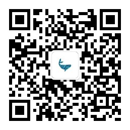

# 鲸析数据科学项目第二期

## 👉个人微信

## 👉个人公众号：鲸析

## 👉个人网站：

* https://zg104.github.io

## 👉情况调查

请填写【腾讯文档】鲸析DS项目第二期学员情况 👇👇👇

[文档链接🔗](https://docs.qq.com/sheet/DRWlVWEpLYkFFdnZx)

## 👉项目须知

请查看下方公众号链接：

[鲸析DS项目第二期通知](https://mp.weixin.qq.com/s/ERd90eSg960QQls7PMZyjw)

## 👉项目简介

- 由巴西的最大规模保险公司发起的基于司机的高维度非显性化特征的发起索赔概率预测项目。

- 👍[原项目链接🔗](https://www.kaggle.com/c/porto-seguro-safe-driver-prediction)

- [鲸析DS项目视频介绍](http://xhslink.com/taexhg)

## 👉常见问题

### 和自学有啥区别？

如果你对数据科学有很强的兴趣，有足够时间去摸索，并且对自己的技术充满信心，并且自己也能狗找到志同道合的朋友一起玩耍，那么建议自学。

不然为什么不来参与？

先问问自己几个问题：

1️⃣ 你有一个沉浸式的数据科学学习氛围么？
2️⃣ 你一个月时间自己可以完成项目么？
3️⃣ 你看网上代码可以理解、挖掘所有知识点、易错点么？
4️⃣ 你能学习建设自己的一套数据分析、建模体系么？
5️⃣ 你能完整的跟面试官端到端地叙述整个项目，接住面试官所有的问题么？

1. **思维引导+代码拆解+视频讲解** 至少你在我这里不会因为看了我视频讲解而技术性劝退。
2. **组长督促+组内讨论+组间竞争** 志同道合的人就在身边，随时组队随时讨论交流，既认识很多朋友，又可以讨论问题。
3. **面试提升+case梳理+简历完善** 没有portfolio、website不着急么？海外求职也好、国内求职也罢，一份闭环的项目流程经历会让你超过很多peers。

### 鲸析的优势在哪？

1. **物超所值**（跟市场比一比就知道了）
2. **全链路教程**（真正的端到端做项目，不阉割任何步骤）
3. **全程追踪**（切实了解各阶段伙伴需求，不断迭代优化，内容不是一成不变）
4. **中英项目展示**（真实的presentation场景，扎心的组长challenge）
5. **背景提升**（光荣写入简历、附上github链接）

最终，欢迎大家加入【鲸析】大家庭！一起学习，一起进步！
