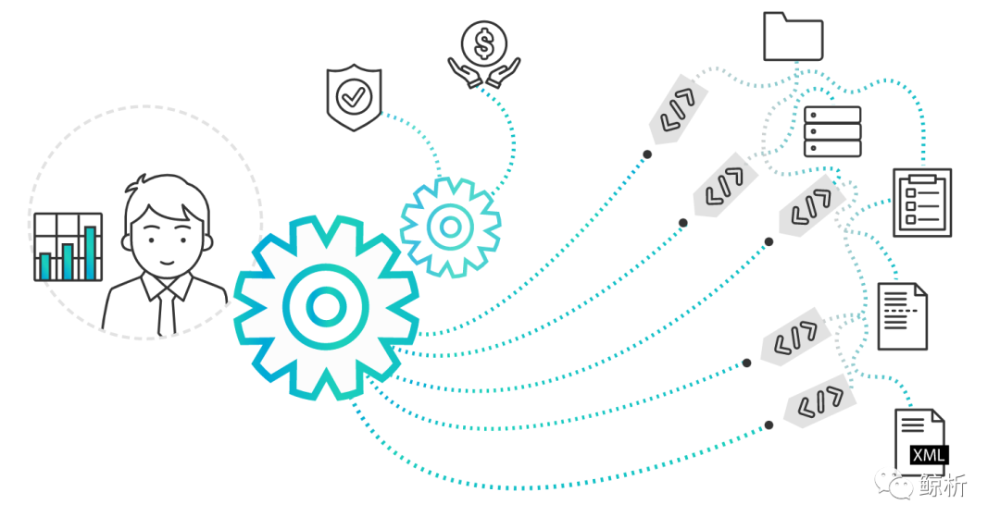
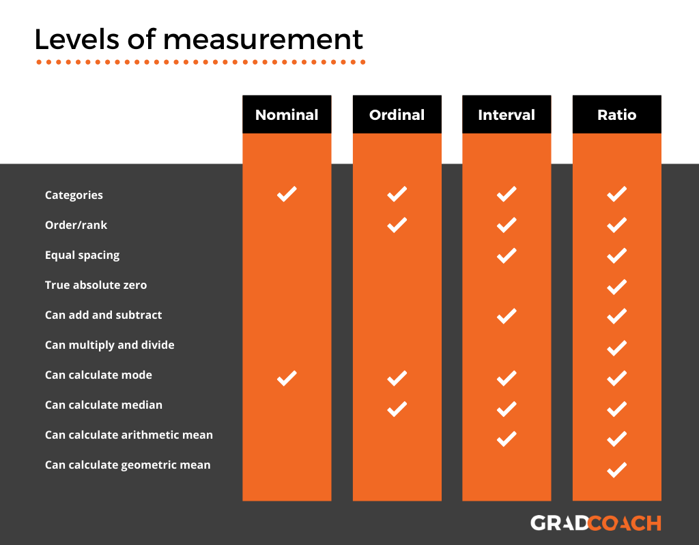
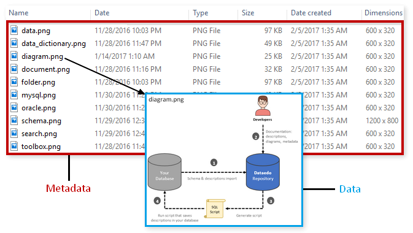
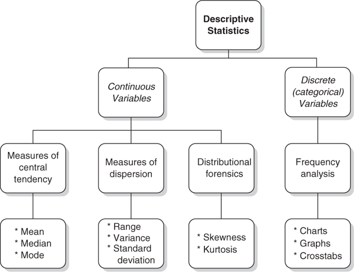

## 第二阶段 元数据&Matplotlib

原项目链接：https://www.kaggle.com/c/porto-seguro-safe-driver-prediction

点击下方👇👇👇logo，获取更多内容~

### ❤️阶段目标

#### 5大变量类型的联系与区别

- 链接：http://xhslink.com/JOqPjg

#### 元数据框架

- 掌握数据框架、构建方法、对于高维数据的使用价值和好处

#### 熟悉基于元数据的描述性分析方法

#### 掌握Matplotlib🆕

 
### 💛阶段内容   

- 直播：北京时间2022年4月10日（ **晚9:00 - 晚9:50** ）【上半场】 
    1. 详细梳理5大变量类型的联系与区别
    2. 讲解元数据方法论、实际价值、实现方法以及迭代模式

- 直播：北京时间2022年4月10日（ **晚10:00 - 晚11:00** ）【下半场】
    1. 梳理描述性统计实现方法
    2. 讲解Matplotlib
    3. 讲解groupby/window function 🔥🔥🔥

### 💚阶段周期

- 4月8日至4月15日

- 作业截止日期为北京时间4月14日晚上12点

### 💙作业安排

- 第二阶段项目notebook：Phase2
- Matplotlib作业
- 英文专业词汇整理

### 💜其他

- 直播录屏会在直播后当天公布
- 作业答案会在4月15日早上10点公布
