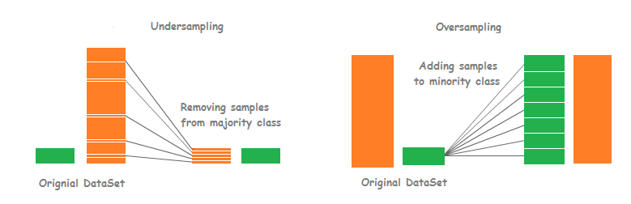
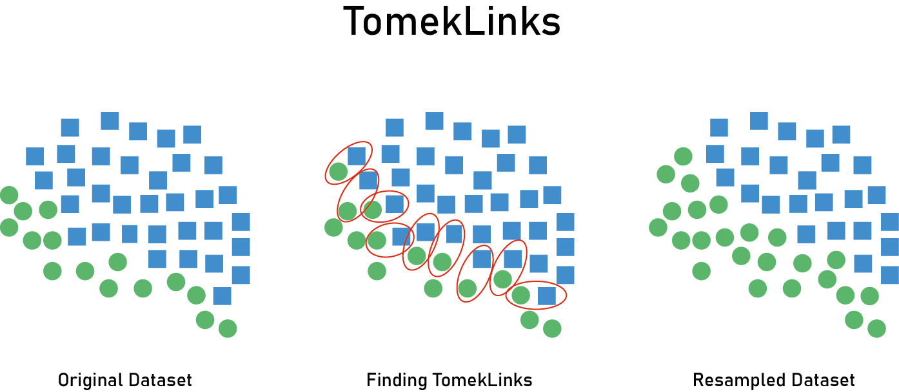
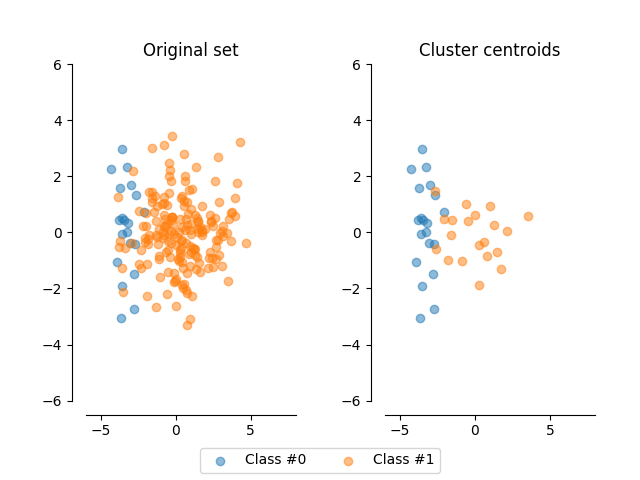
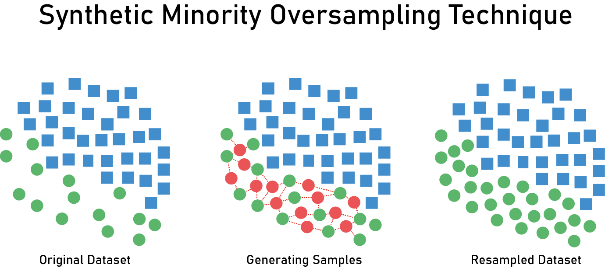
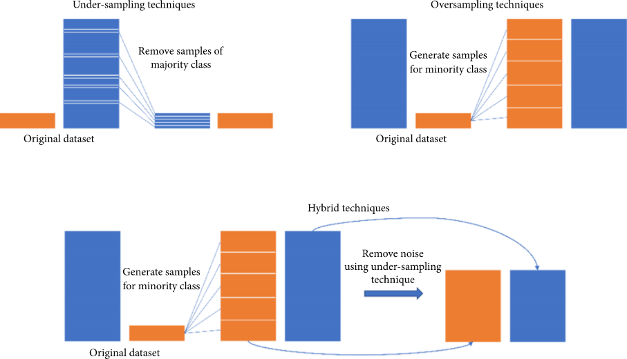
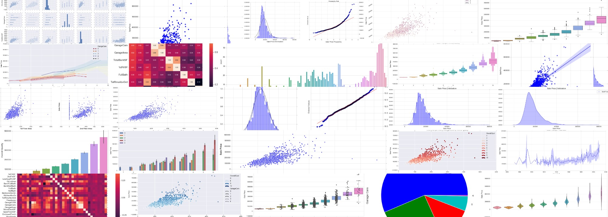

## 第三阶段 不平衡学习&Seaborn

原项目链接：https://www.kaggle.com/c/porto-seguro-safe-driver-prediction

点击下方👇👇👇logo，获取更多内容~

### ❤️阶段目标

#### 不平衡类别学习（imblearn）

  - 不平衡性数据的适用场景、处理思路以及模型评估方法 🆕
  - 随机上下采样（undersampling & oversampling）利弊 🆕
    
  - imblearn模块使用方法汇总 🆕
    - Under-sampling: Tomek links
    
    - Under-sampling: Cluster Centroids
    
    - Over-sampling: SMOTE
    
    - 联合采样
    

#### 掌握Seaborn🆕
    

 
### 💛阶段内容   

- 直播：北京时间2022年4月17日（ **晚9:00 - 晚9:50** ）【上半场】 
    1. 不平衡类别学习（简称imb）的适用场景 🆕
    2. imb的常用模型评估指标&普通指标的区别 🆕
    3. imblearn模块使用方法汇总 🆕

- 直播：北京时间2022年4月17日（ **晚10:00 - 晚11:00** ）【下半场】
    1. 下采样: Tomek links & Cluster Centroids 🆕
    2. 上采样：SMOTE 🆕
    3. 联合采样 🆕
    4. 讲解Seaborn 🆕

### 💚阶段周期

- 4月15日至4月22日

- 作业截止日期为北京时间4月21日晚上12点

### 💙作业安排

1. 第三阶段项目notebook：Phase3
2. Seaborn作业 🆕
3. 英文专业词汇整理 🆕

### 💜其他

- 直播录屏会在直播后当天公布
- 作业答案会在4月22日早上10点公布
