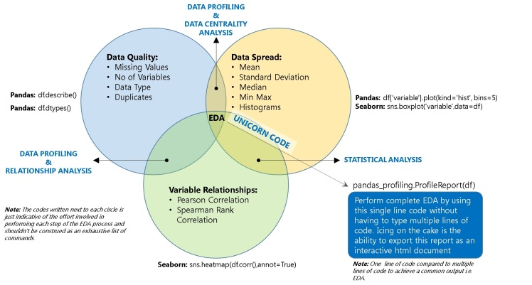
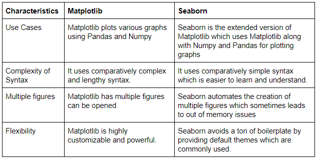
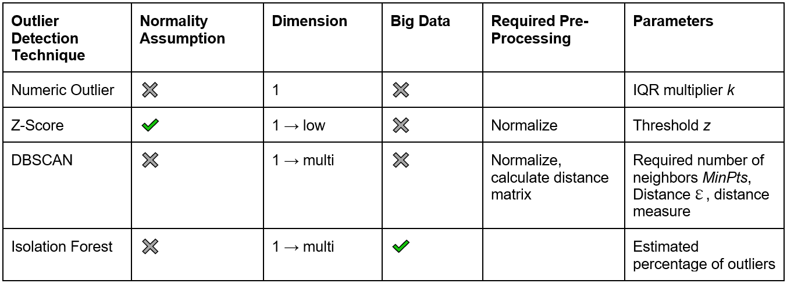
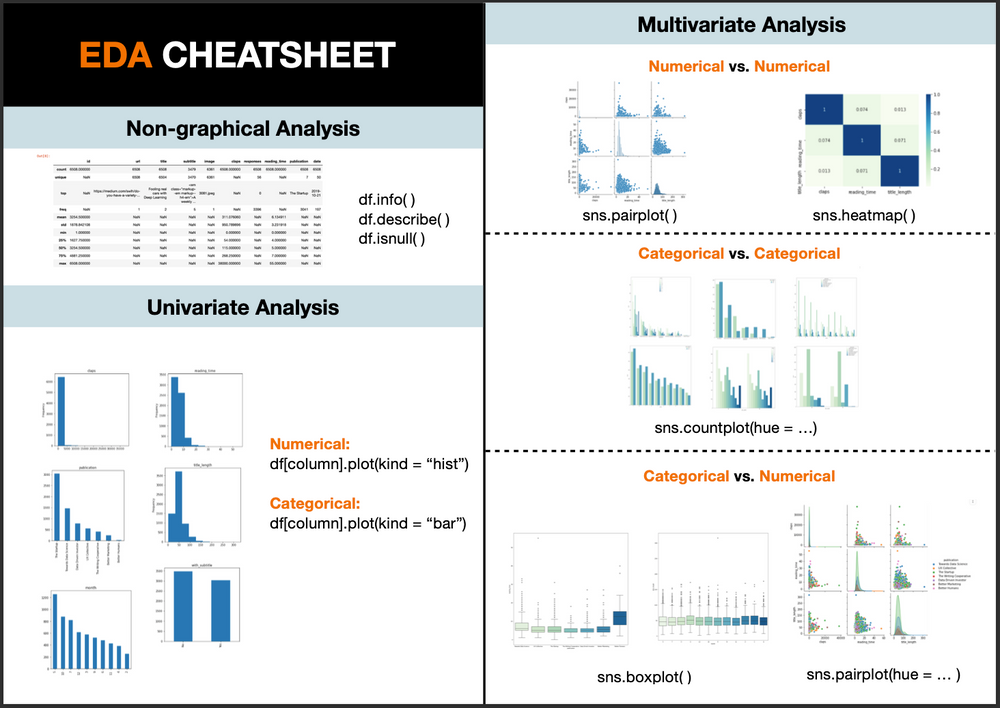
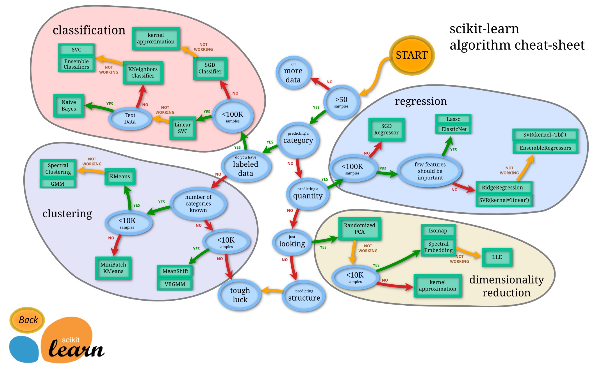

## 第四阶段 探索性分析（EDA）&Sklearn

原项目链接：https://www.kaggle.com/c/porto-seguro-safe-driver-prediction

点击下方👇👇👇logo，获取更多内容~

### ❤️阶段目标

#### 掌握EDA思路、流程及方法

- 熟练使用Matplotlib/Seaborn绘制图表，并能通过图表分析特征 🆕

- 异常值、离群值的检测和处理方法汇总 🆕
    - missing values treatment
    

    - outliers treatment
    

- pandas_profiling使用方法汇总 🆕

- 通过EDA对特征进行合理解释 

#### 掌握Sklearn 🆕

    

 
### 💛阶段内容   

- 直播：北京时间2022年4月24日（ **晚9:00 - 晚9:50** ）【上半场】 
    1. Matplotlib/Seaborn图表特征分析 🆕
    2. pandas_profiling使用总结 🆕

- 直播：北京时间2022年4月24日（ **晚10:00 - 晚11:00** ）【下半场】
    1. 异常值、离群值处理方法实战 🆕
    2. 讲解Sklearn 🆕

### 💚阶段周期

- 4月22日至4月29日
- 作业截止日期为北京时间4月28日晚上12点

### 💙作业安排

- 第四阶段项目notebook：Phase4
- Sklearn作业 🆕
- 英文专业词汇整理 🆕

### 💜其他

- 直播录屏会在直播后当天公布
- 作业答案会在4月29日早上10点公布
