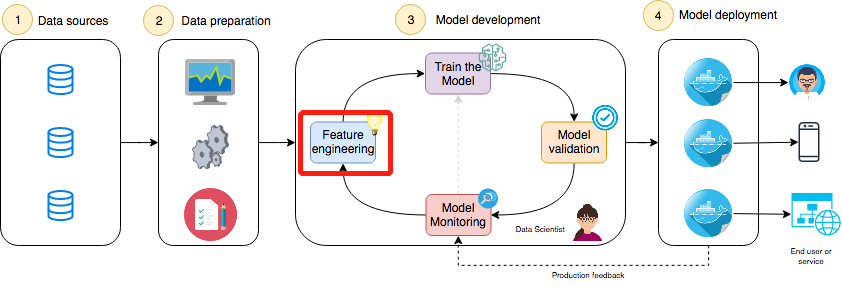
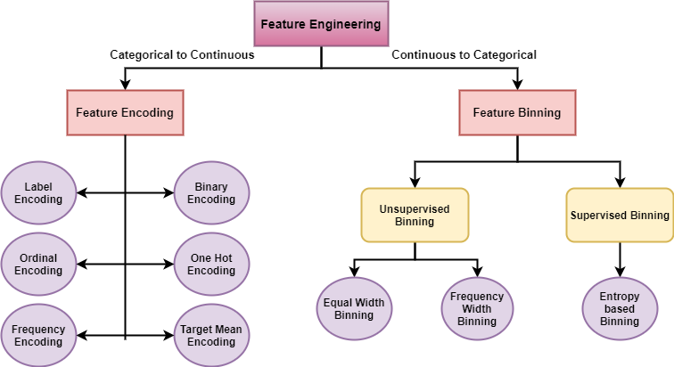
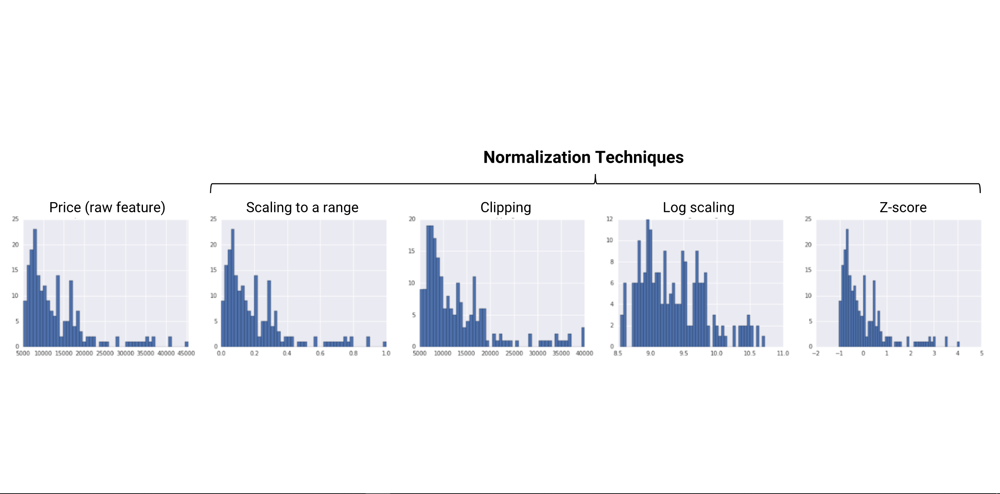
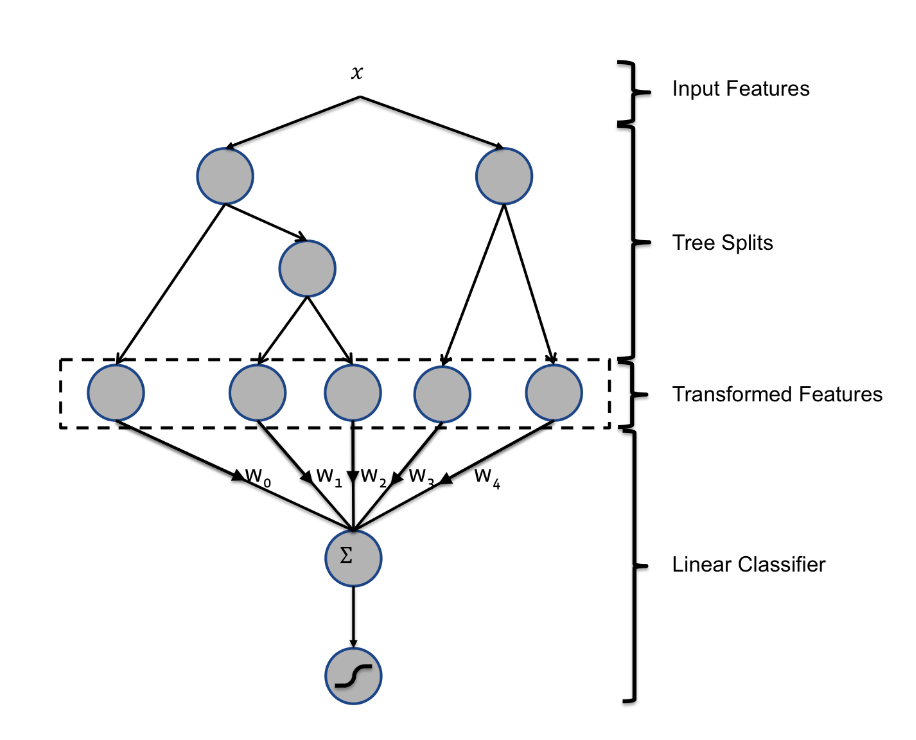

## 第五阶段 特征工程&特征选择

原项目链接：https://www.kaggle.com/c/porto-seguro-safe-driver-prediction

点击下方👇👇👇logo，获取更多内容~

### ❤️阶段目标

#### 掌握特征工程的适用场景、实现方法

##### 5大编码方法

- label encoding
- ordinal encoding
- onehot encoding
- target encoding  🔥🔥
- clustering encoding  🔥🔥

##### 数据分箱

- 无监督：等距、等频
- 有监督：卡方、最小熵  🆕
- WOE/IV贡献 🆕

##### 数据转换

- scaling
- normalization
- cliping
- log scaling
- z-score

##### 特征增强
- 特征交互：
    - 多项式构造
- 特征转换
    - GBDT+LR
    
- 特征降维
    - pca
    - T-SNE

##### 特征选择

- 基于统计指标
    - 方差
    - 相关性
    - 基尼系数
    - 信息增益
- 基于模型
    - 树形模型
    - RFE等
 
### 💛阶段内容   

- 直播：北京时间2022年5月1日（ **晚9:00 - 晚9:50** ）【上半场】 
    1. 特征编码方法&实现
    2. 数据分箱
    3. 数据转换

- 直播：北京时间2022年5月1日（ **晚10:00 - 晚11:00** ）【下半场】
    1. 特征增强
    2. 特征选择

### 💚阶段周期

- 4月29日至5月6日
- 作业截止日期为北京时间5月5日晚上12点

### 💙作业安排

- 第五阶段项目notebook：Phase5
- 英文专业词汇整理 🆕

### 💜其他

- 直播录屏会在直播后当天公布
- 作业答案会在5月6日早上10点公布
