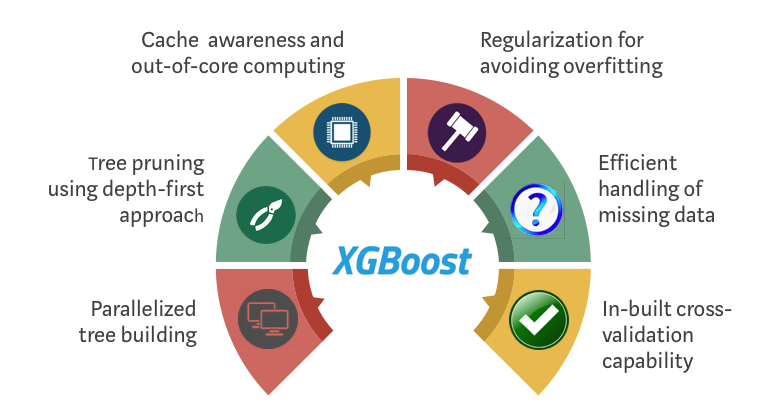

## 第六阶段 机器学习建模

原项目链接：https://www.kaggle.com/c/porto-seguro-safe-driver-prediction

点击下方👇👇👇logo，获取更多内容~

### ❤️阶段目标

#### 机器学习算法

- Linear regression / logistic regression / LDA/QDA / SVM
- Decision Tree / Random Forest / GBDT / XGBoost / LightGBM / CatBoost 

#### XGBoost

- 参数调节
    
- 迭代优化

 
### 💛阶段内容   

- 直播：北京时间2022年5月8日（ **晚9:00 - 晚9:50** ）【上半场】 
    - Linear regression / logistic regression / LDA/QDA / SVM

- 直播：北京时间2022年5月8日（ **晚10:00 - 晚11:00** ）【下半场】
    1. Decision Tree / Random Forest / GBDT / XGBoost / LightGBM / CatBoost 
    2. XGBoost参数调节&迭代优化

### 💚阶段周期

- 5月6日至5月13日 
- 作业截止日期为北京时间5月12日晚上12点

### 💙作业安排

- 第六阶段项目notebook：Phase6
- 英文专业词汇整理 🆕

### 💜其他

- 直播录屏会在直播后当天公布
- 作业答案会在5月12日早上10点公布
