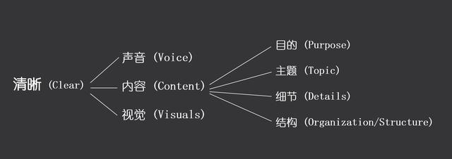
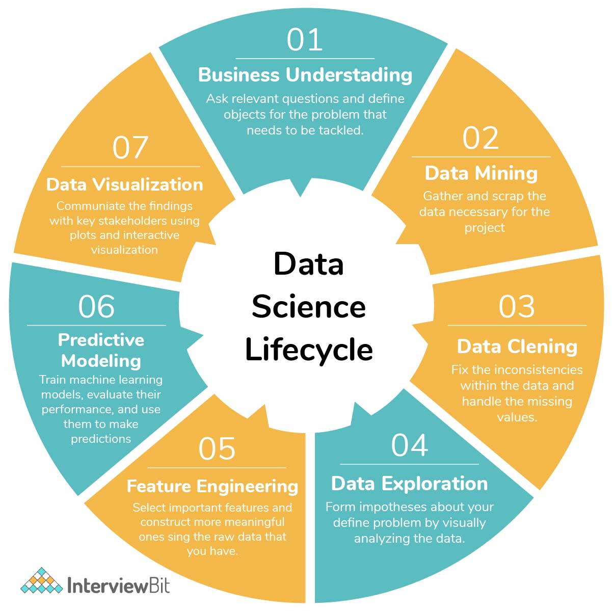
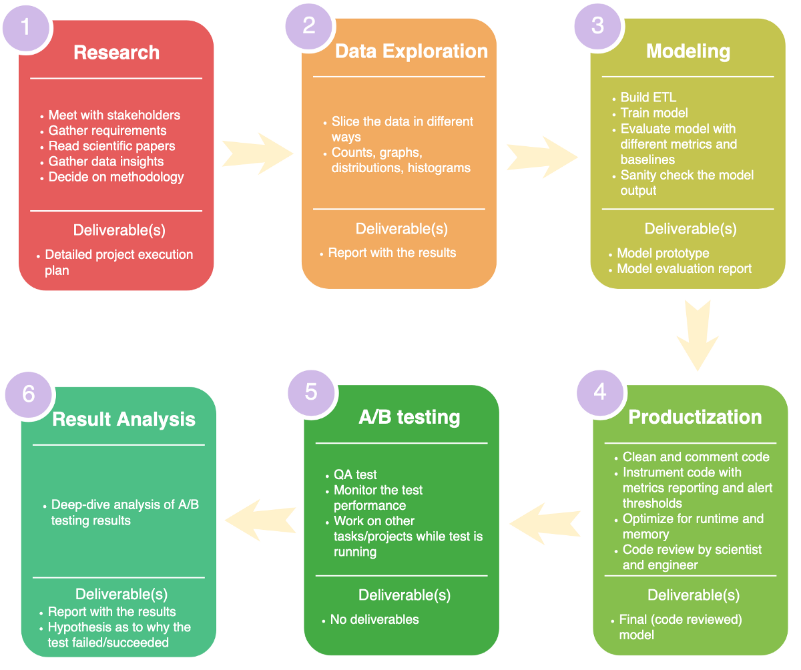
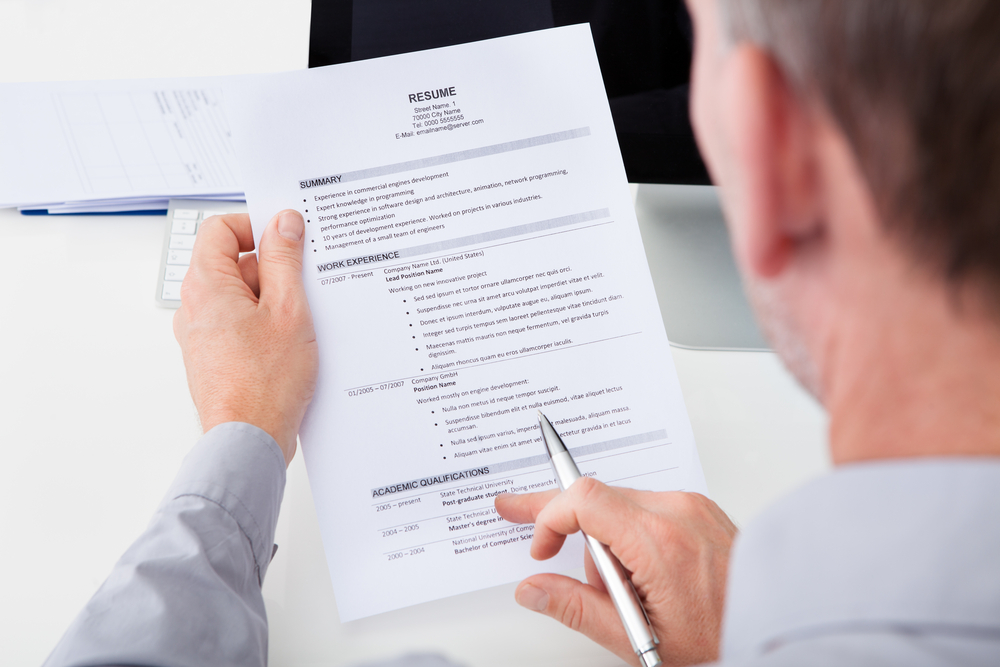

## 第七阶段 项目展示&复盘&简历优化

原项目链接：https://www.kaggle.com/c/porto-seguro-safe-driver-prediction

点击下方👇👇👇logo，获取更多内容~

### ❤️阶段目标

#### PPT演讲

#### 面试模拟

#### 总结复盘

#### 简历优化

 
### 💛阶段内容   

- 直播：北京时间2022年5月15日（ **晚9:00 - 晚9:50** ）【上半场】 
    - PPT演讲
    - 提问模拟

- 直播：北京时间2022年5月8日（ **晚10:00 - 晚11:00** ）【下半场】
    1. 项目复盘
    2. 简历优化

### 💚阶段周期

- 5月13日至5月20日 
- 作业截止日期为北京时间5月19日晚上12点

### 💙作业安排

- 项目展示PPT

### 💜其他

- 直播录屏会在直播后当天公布
